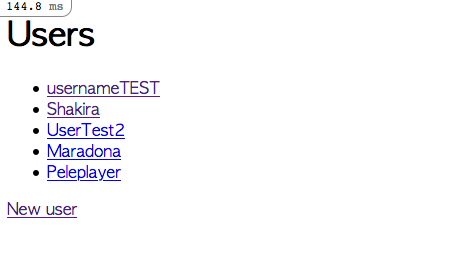

# Bare Metal Forms and Helpers

> In this project we built a basic form using Rails.
# Screenshot

In this simple form, you can perform operations like Create a new user, edit an existing user or show all existing users in the database.

The purpose of the project was help us learn how to build forms using the form helpers built into Rails, like `form_with` and `form_tag`.

## Built With
- Ruby version 3.0.0
- Ruby on Rails 6.1.1

## Getting Started
To get a local copy up and running follow these simple example steps.

### Prerequisites
- Linux/Mac Operating systems

### Setup
1. Open your terminal or command prompt.
2. If you don’t have git installed in your system, skip this step and go to step 3. If you do have git installed in your system, clone this repository to your computer in any directory you want by copying this text into your command prompt/terminal: `git clone https://github.com/StarSheriff2/forms-app.git`  .
 Now go to "Install" section
3. If you don’t have git installed in your system, you can download the program files. To do this, click on the green button that says “**Code**“, on the upper right side of the project frame.
4. You will see a dropdown menu. Click on “**Download ZIP**“.
5. Go to the directory where you downloaded the **ZIP file** and open it. Extract its contents to any directory you want in your system.

### Install
1. If you are not in your system terminal/command prompt already, please open it and go to the directory where you cloned the remote repository or extracted the project files.
2. While in the root directory, type `bundle install`. This will install all the necessary gems in your system.
3. Then you can type <code>yarn install --check-files</code>.
4. Now type <code>bin/rails db:migrate</code> to migrate the database.
### Usage
1. Run <code>bin/rails server</code>
2. Open http://localhost:3000/ on your favorite web browser and create a new user
3. You can also edit existing users

## Authors

👤 **Arturo Alvarez**

- GitHub: [@StarSheriff2](https://github.com/StarSheriff2)
- Twitter: [@ArturoAlvarezV ](https://twitter.com/ArturoAlvarezV )
- LinkedIn: [Arturo Alvarez](https://www.linkedin.com/in/arturoalvarezv/)

👤 **Carlos Ospina**

- GitHub: [@carloso0114](https://github.com/carloso0114)
- LinkedIn: [Carlos Ospina](https://www.linkedin.com/in/carlosospina/)

## 🤝 Contributing

Contributions, issues, and feature requests are welcome!

Feel free to check the [issues page](https://github.com/StarSheriff2/forms-app/issues).

## Show your support

Give a ⭐️ if you like this project!

## Acknowledgments

- Project based on RoR official docs  
https://guides.rubyonrails.org/

- The Odin Project  
https://www.theodinproject.com/courses/ruby-on-rails/lessons/forms
## 📝 License

This project is [MIT](https://github.com/StarSheriff2/forms-app/blob/form-feature/LICENSE) licensed.

